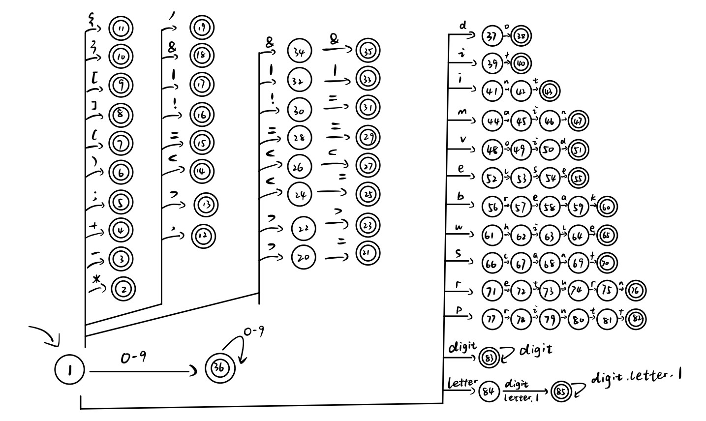
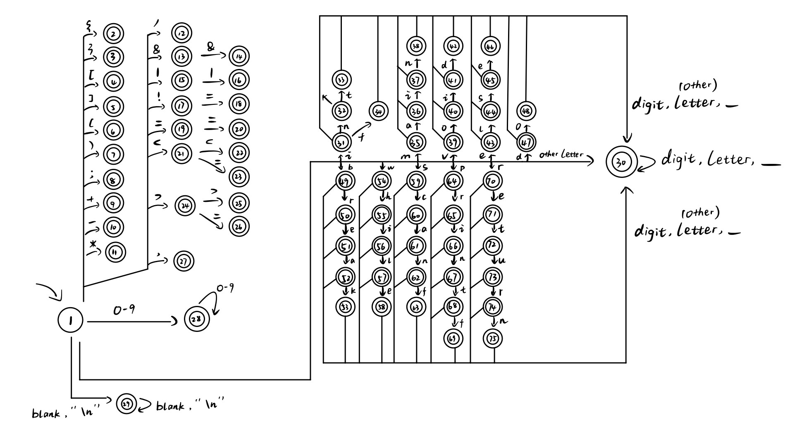

# Specification - Scanner

## How to run the program:

Programming language: C++ => `g++` is needed.

Dockerfile content:

```dockerfile
FROM ubuntu:18.04

RUN apt-get clean && apt-get update && apt-get install make g++ -y
```

File structure:

```shell
.
|-- scanner.Dockerfile
|-- scanner-report.pdf
`-- SourceCode
    |-- makefile
    |-- run_scanner.sh
    |-- scanner.cpp
    `-- Test_cases
        |-- test1.c
        |-- test2.c
        |-- test3.c
        |-- test4.c
        `-- test5.c
```

⭐︎**IMPORTANT: please put test files under`"Test_cases"` folder**.

 **Also use `sh run_scanner.sh test1.c` instead of `./run_scanner.sh test1.c` below.**

```shell
(base) −> docker build -f scanner.Dockerfile -t scanner .
(base) −> docker run -it --privileged=true --mount type=bind,source=/root/Compiler/a2/SourceCode,target=/opt/scanner_src/ scanner bash
−> cd /opt/scanner_src
−> make clean
−> make all
−> sh run_scanner.sh test1.c
Token: INT
Token: MAIN
Token: LPAR
...
```


## How I design NFA

Like what is introduced in Lecture / Tutorial, to design NFA, we just simply graph it according to the category of tokens defined in the assignment spec. The NFA graph is shown below:




## How I design DFA (transform the NFA into DFA)

For every stage in NFA, we find its closure, merge them together into one stage, and eventually get into the same stage.

To simplify the graphics, I rearrange the sequence number of each stage, i.e., the stage number of DFA is irrelevant to the NFA's. 




## How I design the scan function?

Like what is introduced in tutorial, after converting it into the DFA, we can use two data structure to store its info:

1. dfa_states_vector: Here I used `vector<unordered_map<char, int>>` to stored the array of the key-value pair of the status.
2. final_state_map: Here I used `unordered_map<int, string>` to store the key-value pair of the key-value pair of the final state.

I used a class to encapsulate the details. The data are shared among the class member functions (as a private member variable).

For the `scan()` function:

- First, read the character from file input one by one.
- The initial state is 1.
- Check the next state
  - If we can find the path to the next state in NFA, go for it. -- In our design, that's to find whether `unordered_map<char, int>` of `vector[1]` stored the key-value pair of its info.
  - If not, 
    - Check if the current stage is the "final stage", if not, throw an error
    - Find the corresponding "final stage" info from the final_state_map.
    - Switch current stage to 1.
    - Check if the character can lead stage 1 outbound to somewhere new, then go for it. (If not, throw an error)
- After traversal of all the characters, check the last `current status`
  - If it's of the final stage, print the relevant info
  - If not, throw an error.


